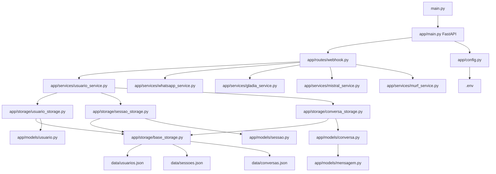

I have created the following plan after thorough exploration and analysis of the codebase. Follow the below plan verbatim. Trust the files and references. Do not re-verify what's written in the plan. Explore only when absolutely necessary. First implement all the proposed file changes and then I'll review all the changes together at the end.

## Observações sobre o Código Atual

O projeto está em estado inicial com apenas arquivos básicos (`pyproject.toml` vazio, `main.py` placeholder). A documentação técnica está bem estruturada em `docs/`, com especificações detalhadas dos fluxos e integrações de APIs. O projeto requer uma arquitetura FastAPI modular completa, com armazenamento JSON para usuários e conversas, seguindo as preferências de código documentadas (português obrigatório, tipagem estrita, princípios SOLID, funções pequenas).

## Abordagem Escolhida

A abordagem adota uma arquitetura em camadas com separação clara de responsabilidades: **rotas** (endpoints FastAPI), **serviços** (lógica de negócio), **modelos** (schemas Pydantic), e **storage** (persistência JSON). Esta estrutura modular facilita manutenção, testes e escalabilidade futura. O sistema de armazenamento JSON será implementado com classes dedicadas para gerenciar usuários, sessões e conversas, garantindo thread-safety e atomicidade nas operações de leitura/escrita.

## Instruções de Implementação

### 1. Configuração do Gerenciador de Pacotes e Dependências

**Arquivo:** `file:pyproject.toml`

Atualizar o arquivo com as dependências necessárias:

```toml
[project]
dependencies = [
    "fastapi>=0.115.0",
    "uvicorn[standard]>=0.32.0",
    "httpx>=0.27.0",
    "python-multipart>=0.0.12",
    "mistralai>=1.2.0",
    "pydantic>=2.10.0",
    "pydantic-settings>=2.6.0",
]

[project.optional-dependencies]
dev = [
    "pytest>=8.3.0",
    "pytest-asyncio>=0.24.0",
    "ruff>=0.8.0",
]
```

Executar comando para instalar dependências:
```bash
uv sync
```

### 2. Estrutura de Diretórios

Criar a seguinte estrutura de pastas no diretório raiz:

```
app/
├── __init__.py
├── main.py
├── config.py
├── routes/
│   ├── __init__.py
│   └── webhook.py
├── services/
│   ├── __init__.py
│   ├── whatsapp_service.py
│   ├── gladia_service.py
│   ├── mistral_service.py
│   ├── murf_service.py
│   └── usuario_service.py
├── models/
│   ├── __init__.py
│   ├── usuario.py
│   ├── sessao.py
│   ├── conversa.py
│   └── mensagem.py
└── storage/
    ├── __init__.py
    ├── base_storage.py
    ├── usuario_storage.py
    ├── sessao_storage.py
    └── conversa_storage.py

data/
├── usuarios.json
├── sessoes.json
└── conversas.json

temp/
└── audio/
```

### 3. Configuração de Variáveis de Ambiente

**Arquivo:** `file:app/config.py`

Criar classe de configuração usando Pydantic Settings para gerenciar variáveis de ambiente:

- Definir `ConfiguracaoApp` com campos para:
  - `WHATSAPP_TOKEN`: Token de autenticação da WhatsApp Cloud API
  - `WHATSAPP_PHONE_NUMBER_ID`: ID do número de telefone WhatsApp
  - `WHATSAPP_VERIFY_TOKEN`: Token para verificação do webhook
  - `MISTRAL_API_KEY`: Chave da API Mistral
  - `GLADIA_API_KEY`: Chave da API Gladia
  - `MURF_API_KEY`: Chave da API Murf
  - `AMBIENTE`: Ambiente de execução (dev/prod)
  - `DIRETORIO_DADOS`: Caminho para armazenamento JSON (padrão: `./data`)
  - `DIRETORIO_TEMP_AUDIO`: Caminho para arquivos temporários (padrão: `./temp/audio`)

- Usar `pydantic_settings.BaseSettings` com `env_file=".env"`
- Implementar validação de campos obrigatórios
- Criar instância singleton `configuracao` para uso global

**Arquivo:** `file:.env.example`

Criar template de variáveis de ambiente com placeholders.

### 4. Modelos Pydantic

#### 4.1 Modelo de Usuário

**Arquivo:** `file:app/models/usuario.py`

Criar classe `Usuario(BaseModel)` com campos:
- `id_usuario: str` (número de telefone WhatsApp)
- `nome: str | None`
- `data_cadastro: datetime`
- `cota_diaria_usada: int` (segundos de áudio usados)
- `ultima_atualizacao_cota: date`
- `is_processing: bool` (flag de concorrência)

Adicionar método `resetar_cota_se_necessario()` para verificar e resetar cota diária.

#### 4.2 Modelo de Sessão

**Arquivo:** `file:app/models/sessao.py`

Criar classe `Sessao(BaseModel)` com campos:
- `id_usuario: str`
- `estado_atual: EstadoSessao` (enum: AGUARDANDO_NOME, MENU_PRINCIPAL, MENU_TEMAS, MENU_TOPICOS, EM_CONVERSA)
- `tema_selecionado: str | None`
- `topico_selecionado: str | None`
- `agent_id_mistral: str | None`
- `conversation_id_mistral: str | None`
- `ultima_interacao: datetime`

Criar enum `EstadoSessao` com os estados mencionados.

#### 4.3 Modelo de Conversa

**Arquivo:** `file:app/models/conversa.py`

Criar classe `Conversa(BaseModel)` com campos:
- `id_conversa: str` (UUID)
- `id_usuario: str`
- `conversation_id_mistral: str`
- `tema: str`
- `topico: str`
- `data_inicio: datetime`
- `data_fim: datetime | None`
- `feedback_evaluation: int | None` (1 para bom, 0 para problema)
- `feedback_comment: str | None` (comentário descrevendo o problema)

Adicionar método `solicitar_avaliacao() -> str` que retorna mensagem de texto pedindo ao usuário para avaliar a conversa (ex: "Como foi a conversa? Digite 1 para bom ou 0 se teve algo errado").

### 5. Sistema de Armazenamento JSON

#### 5.1 Classe Base de Storage

**Arquivo:** `file:app/storage/base_storage.py`

Criar classe abstrata `BaseStorage[T]` com:
- `__init__(caminho_arquivo: Path)`: Inicializar com caminho do arquivo JSON
- `_ler_arquivo() -> dict[str, T]`: Ler JSON com tratamento de erro (criar arquivo vazio se não existir)
- `_escrever_arquivo(dados: dict[str, T])`: Escrever JSON com indentação e encoding UTF-8
- `obter(chave: str) -> T | None`: Buscar item por chave
- `salvar(chave: str, item: T)`: Salvar/atualizar item
- `listar_todos() -> list[T]`: Retornar todos os itens
- `deletar(chave: str) -> bool`: Remover item

Usar `threading.Lock()` para garantir thread-safety nas operações de I/O.

#### 5.2 Storage de Usuários

**Arquivo:** `file:app/storage/usuario_storage.py`

Criar classe `UsuarioStorage(BaseStorage[Usuario])` com:
- Herdar de `BaseStorage[Usuario]`
- Implementar serialização/deserialização de `Usuario` para/de JSON
- Método `obter_por_telefone(telefone: str) -> Usuario | None`
- Método `atualizar_cota(id_usuario: str, segundos_usados: int)`
- Método `atualizar_flag_processing(id_usuario: str, is_processing: bool)`

#### 5.3 Storage de Sessões

**Arquivo:** `file:app/storage/sessao_storage.py`

Criar classe `SessaoStorage(BaseStorage[Sessao])` com:
- Herdar de `BaseStorage[Sessao]`
- Método `obter_sessao_ativa(id_usuario: str) -> Sessao | None`
- Método `atualizar_estado(id_usuario: str, novo_estado: EstadoSessao)`
- Método `limpar_sessao(id_usuario: str)`: Resetar sessão para estado inicial

#### 5.4 Storage de Conversas

**Arquivo:** `file:app/storage/conversa_storage.py`

Criar classe `ConversaStorage(BaseStorage[Conversa])` com:
- Herdar de `BaseStorage[Conversa]`
- Método `criar_nova_conversa(id_usuario: str, tema: str, topico: str, conversation_id_mistral: str) -> Conversa`
- Método `finalizar_conversa(id_conversa: str)`
- Método `registrar_feedback(id_conversa: str, evaluation: int, comment: str | None)`
- Método `obter_conversas_usuario(id_usuario: str) -> list[Conversa]`

### 6. Serviços Base (Estrutura Inicial)

#### 6.1 Serviço de Usuário

**Arquivo:** `file:app/services/usuario_service.py`

Criar classe `UsuarioService` com:
- `__init__(usuario_storage: UsuarioStorage, sessao_storage: SessaoStorage)`
- `obter_ou_criar_usuario(telefone: str) -> tuple[Usuario, bool]`: Retorna usuário e flag `is_novo`
- `registrar_nome_usuario(telefone: str, nome: str) -> Usuario`
- `verificar_cota_disponivel(id_usuario: str) -> tuple[bool, int]`: Retorna se tem cota e segundos restantes
- `consumir_cota(id_usuario: str, segundos: int)`
- `obter_sessao_usuario(id_usuario: str) -> Sessao`

#### 6.2 Estrutura dos Serviços de API Externa

Criar arquivos vazios (stubs) para os serviços que serão implementados nas fases seguintes:

**Arquivo:** `file:app/services/whatsapp_service.py`
- Classe `WhatsAppService` com métodos stub:
  - `enviar_mensagem_texto(telefone: str, texto: str) -> str` (retorna message_id)
  - `enviar_mensagem_audio(telefone: str, caminho_audio: Path) -> str` (retorna message_id)
  - `fazer_upload_audio(caminho_audio: Path) -> str` (retorna media_id)
  - `baixar_audio(media_id: str) -> Path` (retorna caminho do arquivo baixado)
  - `obter_url_media(media_id: str) -> str` (retorna URL temporária da mídia)
  - `deletar_media(media_id: str) -> bool`

**Arquivo:** `file:app/services/gladia_service.py`
- Classe `GladiaService` com métodos stub:
  - `fazer_upload_audio(caminho_audio: Path) -> str` (retorna audio_url da Gladia)
  - `iniciar_transcrição(audio_url: str) -> str` (retorna transcription_id)
  - `obter_resultado_transcrição(transcription_id: str) -> tuple[str, bool]` (retorna texto e status completo)
  - `transcrever_audio(caminho_audio: Path) -> str` (wrapper que faz upload + transcrição + polling)

**Arquivo:** `file:app/services/mistral_service.py`
- Classe `MistralService` com métodos stub:
  - `iniciar_conversa(agent_id: str, texto_usuario: str) -> tuple[str, str]` (retorna conversation_id e resposta)
  - `continuar_conversa(conversation_id: str, texto_usuario: str) -> str` (retorna resposta)
  - `obter_histórico_conversa(conversation_id: str) -> list[dict]` (retorna histórico de mensagens)
  - `obter_detalhes_conversa(conversation_id: str) -> dict` (retorna metadados da conversa)

**Arquivo:** `file:app/services/murf_service.py`
- Classe `MurfService` com métodos stub:
  - `gerar_audio(texto: str, voice_id: str = "fr-FR-adélie", style: str = "Conversational") -> tuple[Path, float]` (retorna caminho do arquivo e duração em segundos)
  - `gerar_audio_base64(texto: str, voice_id: str = "fr-FR-adélie", style: str = "Conversational") -> tuple[str, float]` (retorna áudio em Base64 e duração)

### 7. Aplicação FastAPI Principal

**Arquivo:** `file:app/main.py`

Criar aplicação FastAPI com:
- Instanciar `FastAPI(title="FrenchTalkIA", version="0.1.0")`
- Configurar CORS se necessário
- Criar evento `@app.on_event("startup")` para:
  - Inicializar diretórios de dados e temp
  - Instanciar storages (usuario, sessao, conversa)
  - Instanciar serviços
  - Armazenar em `app.state` para acesso global
- Incluir routers (webhook será implementado na próxima fase)
- Endpoint de health check: `GET /health` retornando `{"status": "ok"}`

### 8. Ponto de Entrada da Aplicação

**Arquivo:** `file:main.py` (raiz do projeto)

Atualizar para iniciar servidor Uvicorn:

```python
import uvicorn
from app.main import app

if __name__ == "__main__":
    uvicorn.run(
        "app.main:app",
        host="0.0.0.0",
        port=8000,
        reload=True,
        log_level="info"
    )
```

### 9. Arquivos de Dados Iniciais

Criar arquivos JSON vazios no diretório `data/`:

**Arquivo:** `file:data/usuarios.json`
```json
{}
```

**Arquivo:** `file:data/sessoes.json`
```json
{}
```

**Arquivo:** `file:data/conversas.json`
```json
{}
```

### 10. Configuração de Linting

**Arquivo:** `file:ruff.toml`

Criar configuração do Ruff:

```toml
line-length = 100
target-version = "py314"

[lint]
select = ["E", "F", "I", "N", "W", "UP"]
ignore = []

[lint.per-file-ignores]
"__init__.py" = ["F401"]
```

### 11. Gitignore

**Arquivo:** `file:.gitignore`

Adicionar:
```
.env
__pycache__/
*.pyc
.pytest_cache/
.ruff_cache/
data/*.json
temp/
.venv/
```

## Diagrama de Arquitetura



## Tabela de Arquivos e Responsabilidades

| Arquivo | Responsabilidade |
|---------|------------------|
| `file:app/config.py` | Gerenciamento de configurações e variáveis de ambiente |
| `file:app/main.py` | Inicialização da aplicação FastAPI e injeção de dependências |
| `file:app/models/usuario.py` | Schema Pydantic para dados de usuário |
| `file:app/models/sessao.py` | Schema Pydantic para estado de sessão |
| `file:app/models/conversa.py` | Schema Pydantic para histórico de conversas |
| `file:app/storage/base_storage.py` | Classe abstrata para operações de I/O JSON thread-safe |
| `file:app/storage/usuario_storage.py` | Persistência de dados de usuários |
| `file:app/storage/sessao_storage.py` | Persistência de estados de sessão |
| `file:app/storage/conversa_storage.py` | Persistência de histórico de conversas |
| `file:app/services/usuario_service.py` | Lógica de negócio para gestão de usuários e cotas |
| `file:app/services/whatsapp_service.py` | Integração com WhatsApp Cloud API (stub) |
| `file:app/services/gladia_service.py` | Integração com Gladia STT API (stub) |
| `file:app/services/mistral_service.py` | Integração com Mistral AI API (stub) |
| `file:app/services/murf_service.py` | Integração com Murf TTS API (stub) |

## Validação da Implementação

Após implementar a estrutura, validar:

1. **Instalação de Dependências**: Executar `uv sync` sem erros
2. **Linting**: Executar `uvx ruff check app/` sem erros críticos
3. **Inicialização**: Executar `python main.py` e verificar servidor iniciando na porta 8000
4. **Health Check**: Acessar `http://localhost:8000/health` e receber `{"status": "ok"}`
5. **Criação de Arquivos**: Verificar que `data/` e `temp/audio/` foram criados automaticamente
6. **Storage**: Testar operações básicas de leitura/escrita nos storages via Python REPL
